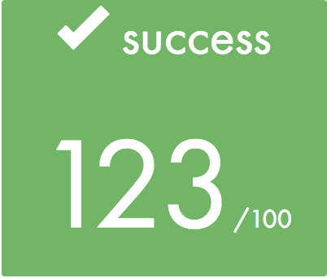
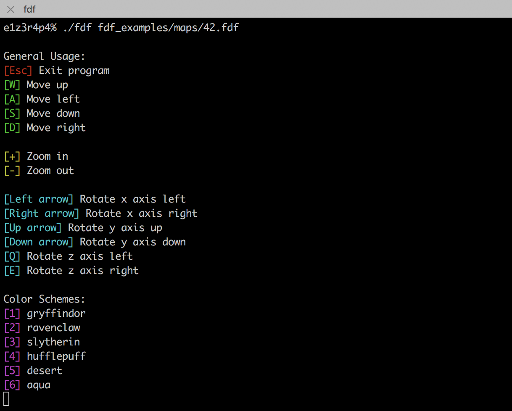
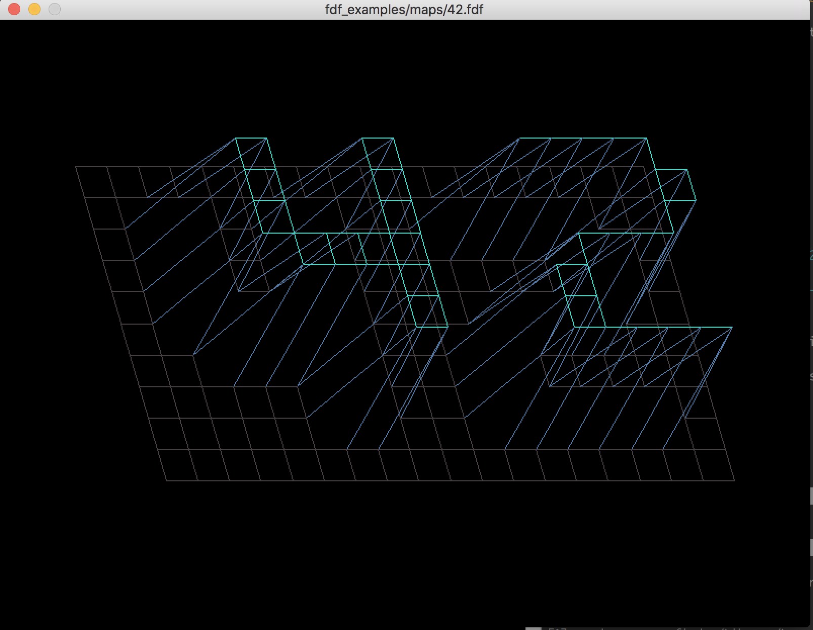
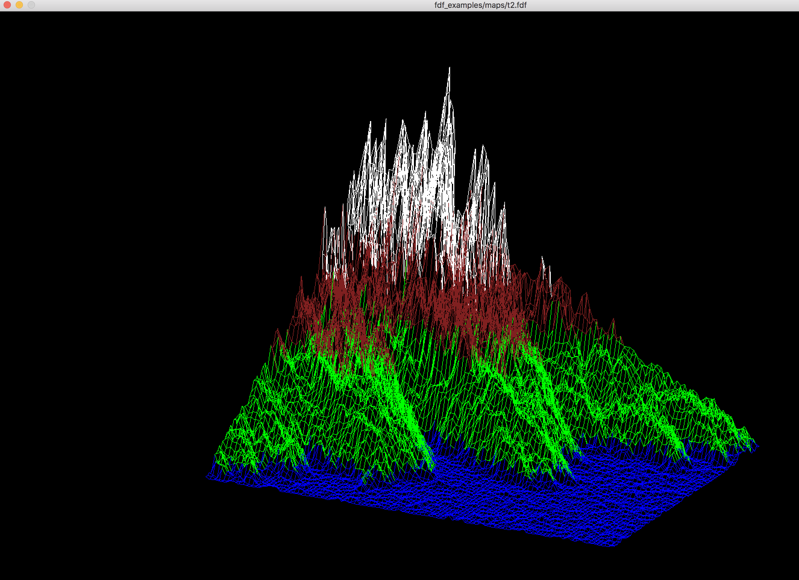
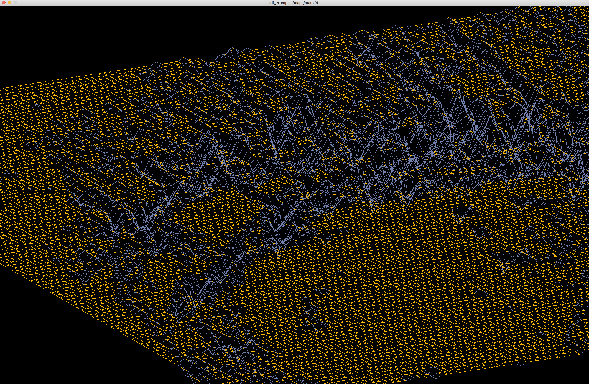
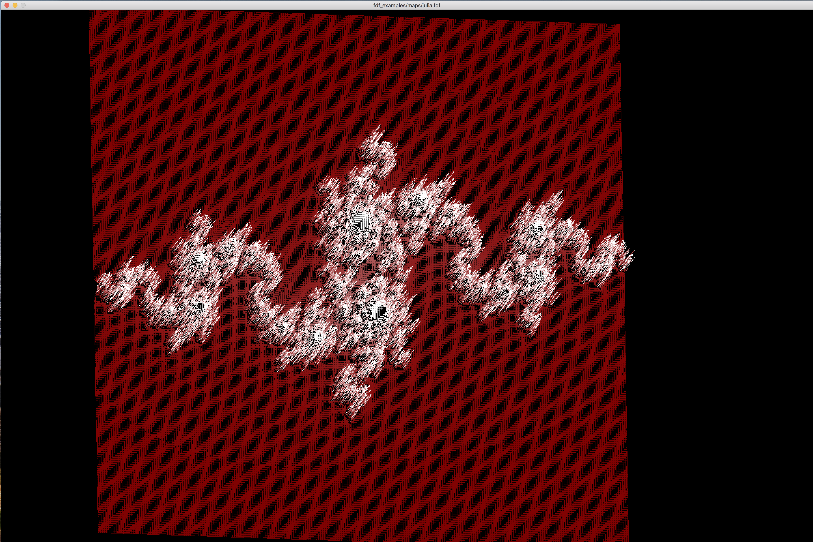

# 42 Project: FDF

This program was made to display 3D wireframe models and to become familiar with the MLX library available to students for use with the graphics branch of the program. 

## Getting Started

### Compiling

Run the following commands:

* To compile
	- `make`
* To remove objects:
	- `make clean`
* To remove objects and binary file (program):
	- `make fclean`
* To re-compile:
	- `make re`

### Executing

To execute the program:

`./fdf <map.fdf>`

*Maps are available in the fdf_examples directory*

#### Try it!

Try running the following:

`./fdfl maps/mars.fdf`

`./fdf maps/42.fdf`

## Screenshots

**Usage:**

**Program running:**

